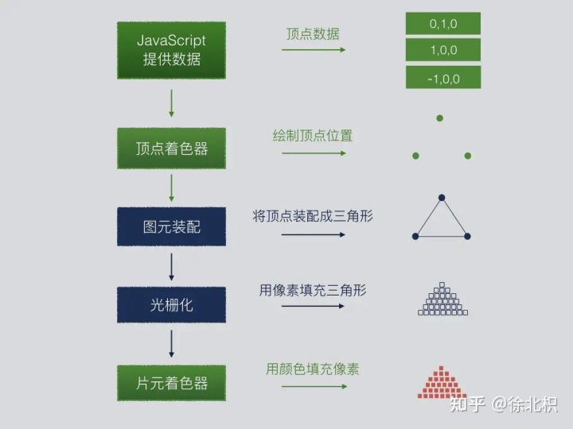

<!--
 * @Author: your name
 * @Date: 2021-12-12 19:44:07
 * @LastEditTime: 2021-12-20 21:58:22
 * @LastEditors: your name
 * @Description: 打开koroFileHeader查看配置 进行设置: https://github.com/OBKoro1/koro1FileHeader/wiki/%E9%85%8D%E7%BD%AE
 * @FilePath: \webgl\1.md
-->
## 渲染管线

## shader 着色器
事实上WebGL仅仅是一个光栅化引擎，它可以根据你的代码绘制出点，线和三角形。 想要利用WebGL完成更复杂任务，取决于你能否提供合适的代码，组合使用点，线和三角形代替实现
你需要使用能够在GPU上运行的代码。 这样的代码需要提供成对的方法。每对方法中一个叫顶点着色器， 另一个叫片断着色器，并且使用一种和C或C++类似的强类型的语言 GLSL。 (GL着色语言)。 每一对组合起来称作一个 program（着色程序）。
顶点着色器的作用是计算顶点的位置。根据计算出的一系列顶点位置，WebGL可以对点， 线和三角形在内的一些图元进行光栅化处理。当对这些图元进行光栅化处理时需要使用片断着色器方法。 片断着色器的作用是计算出当前绘制图元中每个像素的颜色值
